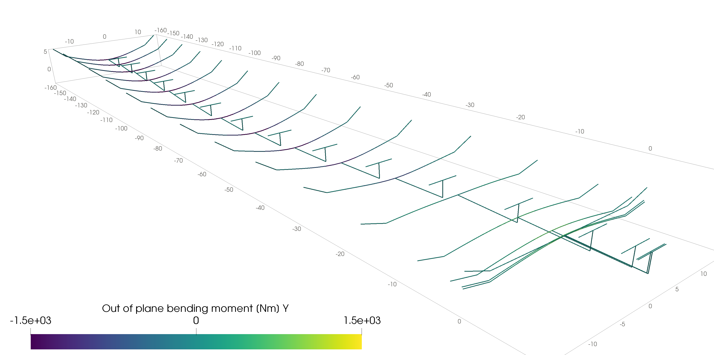
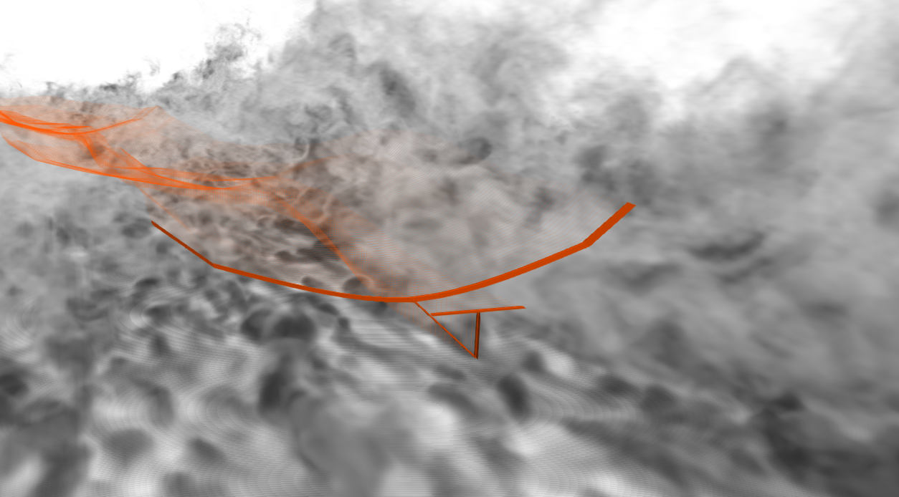
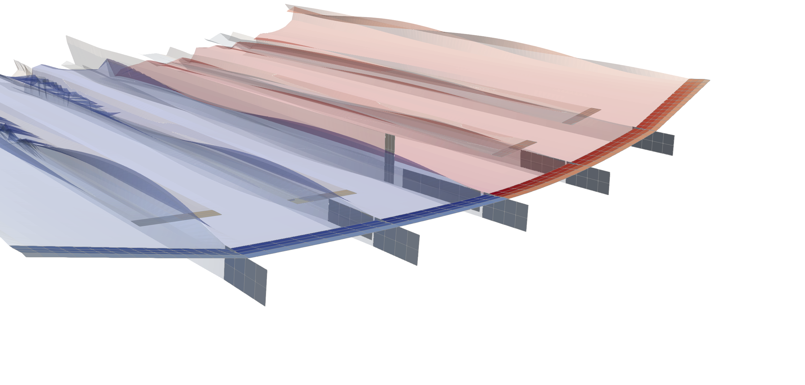
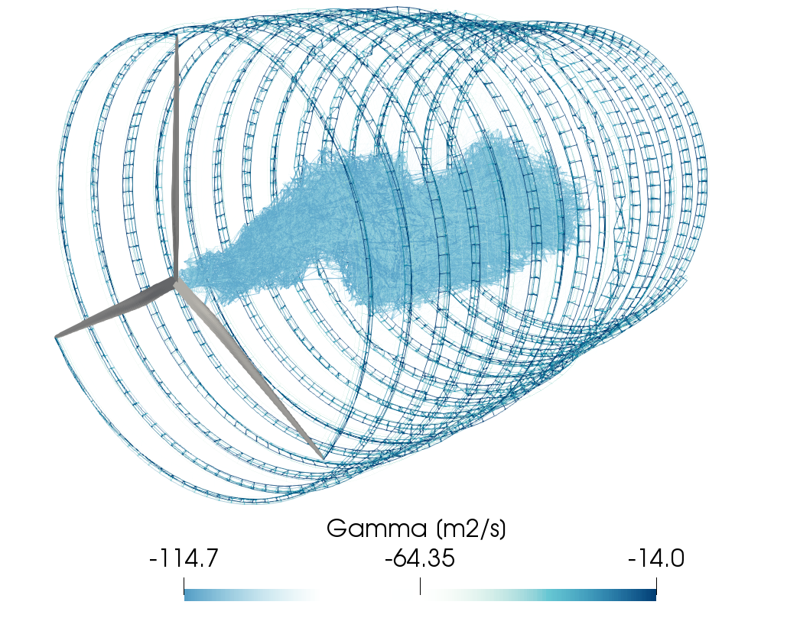
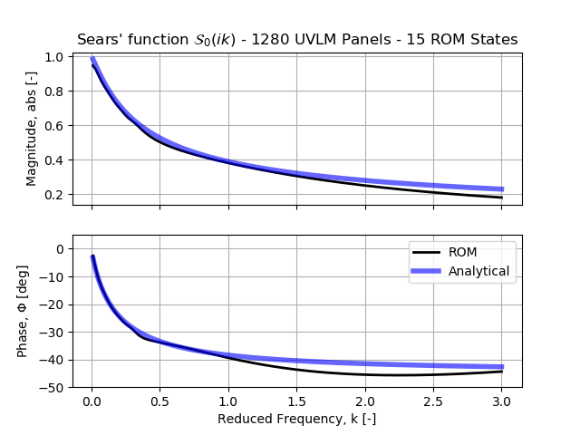
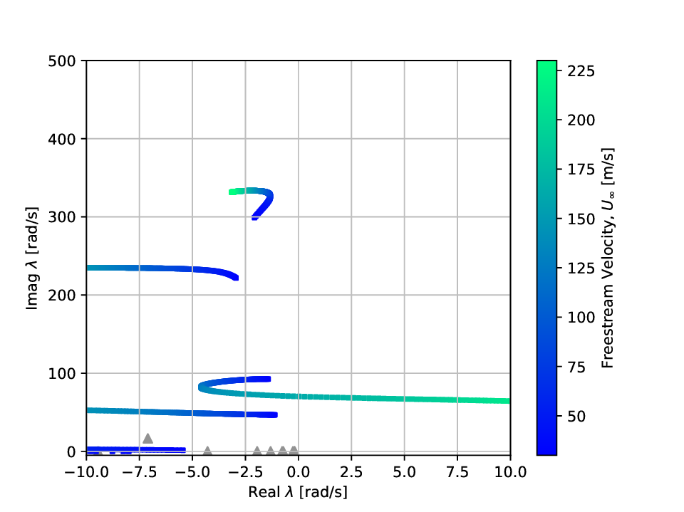

# Capabilities
This is just the tip of the iceberg, possibilities are nearly endless and once you understand how SHARPy's modular
interface works, you will be capable of running very complex simulations.

## Very flexible aircraft nonlinear aeroelasticity

The modular design of SHARPy allows to simulate complex aeroelastic cases involving very flexible aircraft. The
structural solver supports very complex beam arrangements, while retaining geometrical nonlinearity. The UVLM solver
features different wake modelling fidelities while supporting large lifting surface deformations in a native way.

Among the problems studied, a few interesting ones, in no particular order are:

* Catapult take off of a very flexible aircraft analysis [\[Paper\]](https://arc.aiaa.org/doi/abs/10.2514/6.2019-2038). 
In this type of simulations, a PID controller was used in order to enforce displacements and velocities in a number of
structural nodes (the clamping points). Then, several take off strategies were studied in order to analyse the influence
of the structural stiffness in this kind of procedures. This case is a very good example of the type of problems where
nonlinear aeroelasticity is essential.
 
 

* Flight in full 3D atmospheric boundary layer (to be published). A very flexible aircraft is flown immersed in a
turbulent boundary layer obtained from HPC LES simulations. The results are compared against simpler turbulence models
such as von Karman and Kaimal. Intermittency and coherence features in the LES field are absent or less remarkable in
the synthetic turbulence fields.

* Lateral gust reponse of a realistic very flexible aircraft. For this problem (to be published), a realistic very
flexible aircraft (University of Michigan X-HALE) model has been created in SHARPy and validated against their own
aeroelastic solver for static and dynamic cases. A set of vertical and lateral gust responses have been simulated.

## Wind turbine aeroelasticity

SHARPy is suitable to simulate wind turbine aeroelasticity. 

On the structural side, it accounts for material anisotropy which is needed to characterize composite blades and for
geometrically non-linear deformations observed in current blades due to the increasing length and flexibility. Both
rigid and flexible simulations can be performed and the structural modes can be computed accounting for rotational
effects (Campbell diagrams). The rotor-tower interaction is modelled through a multibody approach based on the theory
of Lagrange multipliers. Finally, he tower base can be fixed or subjected to prescribed linear and angular velocities.

On the aerodynamic side, the use of potential flow theory allows the characterization of flow unsteadiness at a
reasonable computational cost. Specifically, steady and dynamic simulations can be performed. The steady simulations
are carried out in a non-inertial frame of reference linked to the rotor under uniform steady wind with the assumption
of prescribed helicoidal wake. On the other hand, dynamic simulations can be enriched with a wide variety of incoming
winds such as shear and yaw. Moreover, the wake shape can be freely computed under no assumptions accounting for
self-induction and wake expansion or can be prescribed to an helicoidal shape for computational efficiency.

## Model Order Reduction
Numerical models of physical phenomena require fine discretisations to show convergence and agreement with their real
counterparts, and, in the case of SHARPy's aeroelastic systems, hundreds of thousands of states are not an uncommon
encounter. However, modern hardware or the use of these models for other applications such as controller synthesis may limit
their size, and we must turn to model order reduction techniques to achieve lower dimensional representations that can
then be used.

SHARPy offers several model order reduction methods to reduce the initially large system to a lower dimension,
attending to the user's requirements of numerical efficiency or global error bound.

### Krylov Methods for Model Order Reduction - Moment Matching
Model reduction by moment matching can be seen as approximating a transfer function through a power series expansion 
about a user defined point in the complex plane. The reduction by projection retains the moments between the full and 
reduced systems as long as the projection matrices span certain Krylov subspaces dependant on the expansion point and 
the system's matrices.
This can be taken advantage of,
in particular for aeroelastic applications where the interest resides in the low frequency behaviour of the system,
the ROM can be expanded about these low frequency points discarding accuracy higher up the frequency spectrum.

#### Example 1 - Aerodynamics - Frequency response of a high AR flat plate subject to a sinusoidal gust
The objective is to compare SHARPy's solution of a very high aspect ratio flat plate subject to a sinusoidal gust to
the closed form solution obtained by Sears (1944 - Ref). SHARPy's inherent 3D nature makes comparing results to the 2D
solution require very high aspect ratio wings with fine discretisations, resulting in very large state space models.
In this case, we would like to utilise a Krylov ROM to approximate the low frequency behaviour and perform a frequency
response analysis on the reduced system, since it would represent too much computational cost if it were performed on
the full system.

The full order model was reduced utilising Krylov methods, in particular the Arnoldi iteration, with an expansion about
zero frequency to produce the following result.

As it can be seen from the image above, the ROM approximates well the low frequency, quasi-steady state and loses
accuracy as the frequency is increased, just as intended. Still, perfect matching is never achieved even at the
expansion frequency given the 3D nature of the wing compared to the 2D analytical solution.

#### Example 2 - Aeroelastics - Flutter analysis of a Goland wing with modal projection
The Goland wing flutter example is presented next. The aerodynamic surface is finely discretised for the UVLM solution,
resulting in not only a large state space but also in large input/output dimensionality. Therefore, to reduce the
number of inputs and outputs, the UVLM is projected onto the structural mode shapes, the first four in this particular
case. The resulting multi input multi output system (mode shapes -> UVLM -> modal forces) was subsequently reduced using
Krylov methods aimed at MIMO systems which use variations of the block Arnoldi iteration. Again, the expansion
frequency selected was the zero frequency. As a sample, the transfer function from two inputs to two outputs is
shown to illustrate the performance of the reduced model against the full order UVLM.

The reduced aerodynamic model projected onto the modal shapes was then coupled to the linearised beam model, and the
stability analysed against a change in velocity. Note that the UVLM model and its ROM are actually scaled to be
independent on the freestream velocity, hence only one UVLM and ROM need to be computed. The structural model needs
to be updated at each test velocity but its a lot less costly in computational terms. The resulting stability of the
aeroelastic system is plotted on the Argand diagram below with changing freestream velocity.

