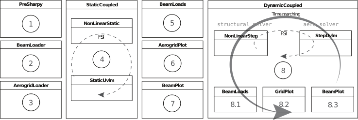

The SHARPy Case files
=====================

SHARPy takes as input a series of ``.h5`` files that contain the numerical data and a ``.sharpy`` file that contains
the settings for each of the solvers. How these files are generated is at the user's discretion, though templates are
provided, and all methods are valid as long as the required variables are provided with the appropriate format.

Modular Framework
-----------------

SHARPy is built with a modular framework in mind. The following diagram shows the strutuctre of a nonlinear, time
marching aeroelastic simulation

Each of the blocks correspond to individual solvers with specific settings. How we choose which solvers to run,
in which order and with what settings is done through the solver configuration file, explained in the next section.

Solver configuration file
-------------------------

The solver configuration file is the main input to SHARPy. It is a ConfigObj_
formatted file with the ``.sharpy`` extension. It contains the settings for each of the solvers and the order in which
to run them.

.. _ConfigObj: http://pypi.org/project/configobj/

A typical way to assemble the solver configuration file is to place all your desired settings
in a dictionary and then convert to and write your ``ConfigObj``. If a setting is not provided the default value will be used. The settings that each solver takes, its type and default value are explained in their relevant documentation pages.

.. code-block:: python

    import configobj
    filename = '<case_route>/<case_name>.sharpy'
    config = configobj.ConfigObj()
    config.filename = filename
    config['SHARPy'] = {'case': '<your SHARPy case name>',  # an example setting
                        # Rest of your settings for the PreSHARPy class
                        }
    config['BeamLoader'] = {'orientation': [1., 0., 0.],  # an example setting
                            # Rest of settings for the BeamLoader solver
                            }
    # Continue as above for the remainder of solvers that you would like to include

    # finally, write the config file
    config.write()

The resulting ``.sharpy`` file is a plain text file with your specified settings for each of
the solvers.

Note that, therefore, if one of your settings is a ``np.array``, it will get transformed into
a string of plain text before being read by SHARPy. However, any setting with ``list(float)`` specified as its setting type will get converted into a ``np.array`` once it is read by SHARPy.

FEM file
--------

The ``case.fem.h5`` file has several components. We go one by one:

*  ``num_node_elem [int]`` : number of nodes per element.

   Always 3 in our case (3 nodes per structural elements - quadratic beam elements).

*  ``num_elem [int]`` : number of structural elements.

*  ``num_node [int]`` : number of nodes.

   For simple structures, it is ``num_elem*(num_node_elem - 1) - 1``. 
   For more complicated ones, you need to calculate it properly.

*  ``coordinates [num_node, 3]``: coordinates of the nodes in body-attached FoR (A).

*  ``connectivites [num_elem, num_node_elem]`` : Beam element's connectivities.

   Every row refers to an element, and the three integers in that row are the indices of the three nodes 
   belonging to that elem. Now, the catch: the ordering is not as you'd think. Order them as ``[0, 2, 1]``. 
   That means, first one, last one, central one. The following image shows the node indices inside the 
   circles representing the nodes, the element indices in blue and the resulting connectivities matrix next to it. 
   Connectivities are tricky when considering complex configurations. Pay attention at the beginning and you'll 
   save yourself a lot of trouble.

*  ``stiffness_db [:, 6, 6]``: database of stiffness matrices.

    The first dimension has as many elements as different stiffness matrices are in the model.

*  ``elem_stiffness [num_elem]`` : array of indices (starting at 0).

    It links every element (index) to the stiffness matrix index in ``stiffness_db``.
    For example ``elem_stiffness[0] = 0`` ; ``elem_stiffness[2] = 1`` means that the element ``0`` has a stiffness matrix
    equal to ``stiffness_db[0, :, :]`` , and the second element has a stiffness matrix equal to
    ``stiffness_db[1, :, :]``.

    The shape of a stiffness matrix, :math:`\mathrm{S}` is:

    .. math::
        \mathrm{S} = \begin{bmatrix}
        EA & & & & & \\
        & GA_y & & & & \\
        & & GA_z & & & \\
        & & & GJ & & \\
        & & & & EI_y & \\
        & & & & & EI_z \\
        \end{bmatrix}

    with the cross terms added if needed.

    ``mass_db`` and ``elem_mass`` follow the same scheme than the stiffness, but the mass matrix is given by:

    .. math::
        \mathrm{M} = \begin{bmatrix}
        m\mathbf{I} & -\tilde{\boldsymbol{\xi}}_{cg}m \\
        \tilde{\boldsymbol{\xi}}_{cg}m & \mathbf{J}\\
        \end{bmatrix}

    where :math:`m` is the distributed mass per unit length :math:`kg/m` , :math:`(\tilde{\bullet})` is the
    skew-symmetric matrix of a vector and :math:`\boldsymbol{\xi}_{cg}` is the location of the centre of gravity
    with respect to the elastic axis in MATERIAL (local) FoR. And what is the Material FoR? This is an important point,
    because all the inputs that move WITH the beam are in material FoR. For example: follower forces, stiffness, mass,
    lumped masses...

    .. image:: ./../_static/case_files/frames_of_reference.jpg
        :target: ./../_static/case_files/frames_of_reference.jpg
        :alt: SHARPy Frames of Reference

    The material frame of reference is noted as :math:`B`. Essentially, the :math:`x` component is tangent to the beam in the
    increasing node ordering, :math:`z` looks up generally and :math:`y` is oriented such that the FoR is right handed.

    In the practice (vertical surfaces, structural twist effects...) it is more complicated than this. The only
    sure thing about :math:`B` is that its :math:`x` direction is tangent to the beam in the increasing node number direction.
    However, with just this, we have an infinite number of potential reference frames, with :math:`y` and :math:`z`
    being normal to :math:`x` but rotating around it. The solution is to indicate a ``for_delta``, or frame of
    reference delta vector (:math:`\Delta`).

    
    .. image:: ../_static/case_files/frame_of_reference_delta.jpg
        :target: ../_static/case_files/frame_of_reference_delta.jpg
        :alt: Frame of Reference Delta Vector

    Now we can define unequivocally the material frame of reference. With :math:`x_B` and :math:`\Delta` defining a
    plane, :math:`y_b` is chosen such that the :math:`z` component is oriented upwards with respect to the lifting surface.

    From this definition comes the only constraint to :math:`\Delta`: it cannot be parallel to :math:`x_B`.

*  ``frame_of_reference_delta [num_elem, num_node_elem, 3]``: rotation vector to FoR :math:`B`.

    contains the :math:`\Delta` vector in body-attached (:math:`A`) frame of reference.

    As a rule of thumb:

    .. math::
        \Delta =
        \begin{cases}
        [-1, 0, 0], \quad \text{if right wing} \\
        [1, 0, 0], \quad \text{if left wing} \\
        [0, 1, 0], \quad \text{if fuselage} \\
        [-1, 0, 0], \quad \text{if vertical fin} \\
        \end{cases}

    These rules of thumb only work if the nodes increase towards the tip of the surfaces (and the tail in the
    case of the fuselage).

*  ``structural_twist [num_elem, num_node_elem]``: Element twist.

    Technically not necessary, as the same effect can be achieved with ``FoR_delta``.

*  ``boundary_conditions [num_node]``: boundary conditions.

    An array of integers ``(np.zeros((num_node, ), dtype=int))`` and contains all ``0`` except for

      - One node NEEDS to have a ``1`` , this is the reference node. Usually, the first node has 1 and is located
        in ``[0, 0, 0]``. This makes things much easier.

      - If the node is a tip of a beam (is not attached to 2 elements, but just 1), it needs to have a ``-1``.

*  ``beam_number [num_elem]``: beam index.

    Is another array of integers. Usually you don't need to modify its value. Leave it at 0.

*  ``app_forces [num_elem, 6]``: applied forces and moments.

    Contains the applied forces ``app_forces[:, 0:3]`` and moments ``app_forces[:, 3:6]`` in a
    given node.

    Important points: the forces are given in Material FoR (check above). That means that in a
    symmetrical model, a thrust force oriented upstream would have the shape ``[0, T, 0, 0, 0, 0]`` in the
    right wing, while the left would be ``[0, -T, 0, 0, 0, 0]``. Likewise, a torsional moment for twisting the wing
    leading edge up would be ``[0, 0, 0, M, 0, 0]`` for the right, and ``[0, 0, 0, -M, 0, 0]`` for the left.
    But careful, because an out-of-plane bending moment (wing tip up) has the same sign (think about it).

*  ``lumped_mass [:]``: lumped masses.

    Is an array with as many masses as needed (in kg this time). Their order is important, as more
    information is required to implement them in a model.

*  ``lumped_mass_nodes [:]``: Lumped mass nodes.

    Is an array of integers. It contains the index of the nodes related to the masses given
    in lumped_mass in order.

*  ``lumped_mass_inertia [:, 3, 3]``: Lumped mass inertia.

    Is an array of ``3x3`` inertial tensors. The relationship is set by the ordering as well.

*  ``lumped_mass_position [:, 3]``: Lumped mass position.

    Is the relative position of the lumped mass with respect to the node
    (given in ``lumped_masss_nodes`` ) coordinates. ATTENTION: the lumped mass is solidly attached to the node, and
    thus, its position is given in Material FoR.

Aerodynamics file
-----------------

All the aerodynamic data is contained in ``case.aero.h5``. 

It is important to know that the input for aero is usually based on elements (and inside the elements, their nodes).
This causes sometimes an overlap in information, as some nodes are shared by two adjacent elements (like in the
connectivities graph in the previous section). The easier way of dealing with this is to make sure the data is
consistent, so that the properties of the last node of the first element are the same than the first node of the
second element.

Item by item:

* ``airfoils``: Airfoil group.

    In the ``aero.h5`` file, there is a Group called ``airfoils``. The airfoils are stored in this group (which acts as a
    folder) as a two-column matrix with :math:`x/c` and :math:`y/c` in each column. They are named ``'0', '1'`` ,
    and so on.

* ``chords [num_elem, num_node_elem]``: Chord

    Is an array with the chords of every airfoil given in an element/node basis.

*  ``twist [num_elem, num_node_elem]``: Twist.

    Has the twist angle in radians. It is implemented as a rotation around the local :math:`x` axis.

*  ``sweep [num_elem, num_node_elem]``: Sweep.

    Same here, just a rotation around :math:`z`.

* ``airfoil_distribution_input [num_elem, num_node_elem]``: Airfoil distribution.

    Contains the indices of the airfoils that you put previously in ``airfoils``.

*  ``surface_distribution_input [num_elem]``: Surface integer array.

    It contains the index of the surface the element belongs
    to. Surfaces need to be continuous, so please note that if your beam numbering is not continuous, you need to make
    a surface per continuous section.

*  ``surface_m [num_surfaces]``: Chordwise panelling.

    Is an integer array with the number of chordwise panels for every surface.

*  ``m_distribution [string]``: Discretisation method.

    Is a string with the chordwise panel distribution. In almost all cases, leave it at ``uniform``.

*  ``aero_node_input [num_node]``: Aerodynamic node definition.

    Is a boolean (``True`` or ``False``) array that indicates if that node has a lifting
    surface attached to it.

*  ``elastic_axis [num_elem, num_node_elem]``: elastic axis.

    Indicates the elastic axis location with respect to the leading edge as a
    fraction of the chord of that rib. Note that the elastic axis is already determined, as the beam is fixed now, so
    this settings controls the location of the lifting surface wrt the beam.

* ``control_surface [num_elem, num_node_elem]``: Control surface.

    Is an integer array containing ``-1`` if that section has no control surface associated to it, and ``0, 1, 2 ...``
    if the section belongs to the control surface ``0, 1, 2 ...`` respectively.

*  ``control_surface_type [num_control_surface]``: Control Surface type.

    Contains ``0`` if the control surface deflection is static, and ``1`` is it
    is dynamic.

*  ``control_surface_chord [num_control_surface]``: Control surface chord.

    Is an INTEGER array with the number of panels belonging to the control
    surface. For example, if ``M = 4`` and you want your control surface to be :math:`0.25c`, you need to put ``1``.

*  ``control_surface_hinge_coord [num_control_surface]``: Control surface hinge coordinate.

    Only necessary for lifting surfaces that are deflected as a
    whole, like some horizontal tails in some aircraft. Leave it at ``0`` if you are not modelling this.

*  ``airfoil_efficiency [num_elem, num_node_elem, 2, 3]``: Airfoil efficiency.

    This is an optional setting that introduces a user-defined efficiency and constant terms to the mapping
    between the aerodynamic forces calculated at the lattice grid and the structural nodes. The formatting of the
    4-dimensional array is simple. The first two dimensions correspond to the element index and the local node index.
    The third index is whether the term is the multiplier to the force ``0`` or a constant term ``1``. The final term refers to,
    in the **local, body-attached** ``B`` frame, the factors and constant terms for: ``fy, fz, mx``.
    For more information on how these factors are included in the mapping terms
    see :func:`sharpy.aero.utils.mapping.aero2struct_force_mapping`.
