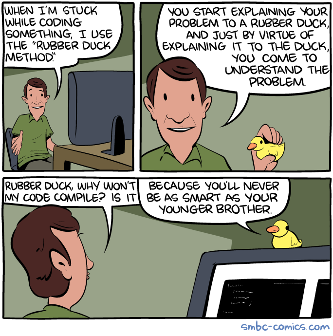

A Short Debugging Guide
-----------------------

We have put together a list of common traps you may fall into, hopefully you will find the tools here to get
yourself out of them!

* Did you forget `conda activate sharpy_env` and `source bin/sharpy_vars.sh`?

    - If you do in the terminal: `which sharpy`, do you get the one you want?
    - If you do `which python`, does the result point to `anaconda3/envs/sharpy_env/bin` (or similar)?

* Wrong input (inconsistent connectivities, mass = 0...)

    * Sometimes not easy to detect. For the structural model, run `BeamLoader` and `BeamPlot` with no structural solver
      in between. Go over the structure in Paraview. Check the `fem.h5` file with HDFView.
    * Remember that connectivities are ordered as $[0, 2, 1]$ (the central node goes last).
    * Make sure the `num_elem` and `num_node` variables are actually your correct number of elements and nodes.

* Not running the actual case you want to.

    * Cleanup the folder and regenerate the case

* Not running the SHARPy version you want.

    * Check at the beginning of the execution the path to the SHARPy folder.

* Not running the correct branch of the code.

    * You probably want to use `develop`. Again, check the first few lines of SHARPy output.

* Very different (I'm talking orders of magnitude) stiffnesses between nodes or directions?

* The UVLM requires a smaller vortex core cutoff?

* Newmark damping is not enough for this case?

* Do you have an element with almost 0 mass or inertia?

* Are you mass matrices consistent? Check that :math:`I_{xx} = I_{yy} + I_{zz}`.

* Have a look at the $\dot{\Gamma}$ filtering and numerical parameters in the settings of `StepUvlm` and
  `DynamicCoupled`.

* Add more relaxation to the `StaticCoupled` or `DynamicCoupled` solvers.

* The code has a bug (depending on where, it may be likely).

    * Go over the rest of the list. Plot the case in paraview. Go over the rest of the list again. Prepare the simplest
      example that reproduces the problem and raise an issue.

* The code diverges because it has to (physical unstable behaviour)
    * Then don't complain
* Your model still doesn't work and you don't know why.
    * `import pdb; pdb.set_trace()` and patience
* If nothing else works... get a rubber duck (or a very very patient good friend) and go over every step

If your model doesn't do what it is supposed to do:

* Check for symmetric response where the model is symmetric.

    * If it is not, run the beam solver first and make sure your properties are correct. Make sure the matrices for mass
      and stiffness are rotated if they need to be (remember the Material FoR definition and the `for_delta`?)

    * Now run the aerodynamic solver only and double check that the forces are symmetric.

    * Make sure your tolerances are low enough so that at least 4 FSI iterations are performed in `StaticCoupled` or
      `DynamicCoupled`.

* Make sure your inputs are correct. For example: a dynamic case can be run with :math:`u_\infty = 0` and the plane
  moving forwards, or :math:`u_\infty = x` whatever and the plane velocity = 0. It is very easy to mix both, and end up with
  double the effective incoming speed (or none).

* Run simple stuff before coupling it. For example, if your wing tip deflections don't match what you'd expect,
  calculate the deflection under a small tip force (not too small, make sure the deflection is > 1% of the length!)
  by hand, and compare.

* It is more difficult to do the same with the UVLM, as you need a VERY VERY high aspect ratio to get close to the 2D
  potential solutions. You are going to have to take my word for it: the UVLM works.

* But check the aero grid geometry in Paraview, including chords lengths and angles.
